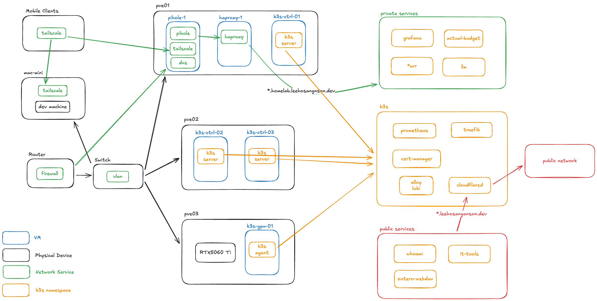

# Homelab

This repository details the configuration and deployment of my Kubernetes-native homelab.

As a Machine Learning Engineer, the purpose of my homelab is to serve as a platform for me to try and learn the newest and greatest, from Cloud Native technologies to state-of-the-art AI models. Since the best way for me to learn is to be under pressure, I started to self-host various kinds of applications for my family such that I am responsible for making any changes to the cluster and keeping the deployments operating 24/7. This repository serves as an artifact to document my journey on maintaining a secure, scalable and efficient homelab.

## Overview

I use k3s for setting up my HA Kubernetes cluster, with 3 Ubuntu VMs as Control nodes, and 1 Ubuntu VM GPU Worker Node. All VMs are provisioned from my Proxmox Cluster with currently 2 Mini PCs and 1 old gaming PC. I chose k3s as it is a lightweight Kubernetes distribution and I can spin up more VMs for node replacment easily from my PVE cluster if it needs more resources.

My most recent addition to the cluster is a GPU node with a low-mid tier consumer graphics card (RTX5060 Ti). It allows me to schedule GPU workload such as local LLM inferencing server, or lightweight model training. With the current configuration, I can easily add more GPU nodes and scale out & up my private LLM inferencing service for AI workflows and Agentic Coding concurrently with my own resources.

## Services

### Applications

| Logo | Name | Description |
|:-:|---|---|
|  | [Actual Budget](https://github.com/actualbudget/actual) | Personal finance management |
|  | [Commafeed](https://github.com/Athou/commafeed) | RSS reader |
|  | [IT-Tools](https://github.com/CorentinTh/it-tools) | Collection of handy online tools for developers |
| | [Uptime Kuma](https://github.com/louislam/uptime-kuma) | Service monitoring and health check |
| | [Minecraft Server](https://github.com/itzg/minecraft-server-charts) | Game server for Minecraft |
|  | [WebDAV](https://github.com/danuk/k8s-webdav) | Database for my Zotero Research Paper Reader |
|  | [Media Services (*arr)](https://github.com/Ravencentric/awesome-arr) | A suite of applications for my media collection management. |

### AI

| Logo | Name | Description |
|:-:|---|---|
|  | [vLLM](https://github.com/vllm-project/vllm) | High-throughput and memory-efficient inference and serving engine for LLMs  |
|  | [LiteLLM](https://github.com/BerriAI/litellm) | LLM Gateway for local LLM servers & other cloud providers. |
|  | [Open WebUI](https://github.com/open-webui/open-webui) | Frontend Chat interface connected to LiteLLM |

### Infrastructure

| Logo | Name | Description |
|:-:|---|---|
|  | [Traefik](https://github.com/traefik/traefik) | Ingress Controller |
|  | [Cloudflare Tunnel](https://github.com/cloudflare/cloudflared) | Zero Trust Tunnel to expose services publicly |
|  | [GPU Operator](https://github.com/NVIDIA/gpu-operator) | NVIDIA runtime class manager for AI/ML workloads |
|  | [Cert Manager](https://github.com/cert-manager/cert-manager) | Automated X.509 certificate management |
|  | [External Secrets Operator](https://external-secrets.io/latest/) | External secrets in Azure Key Vault |
|  | [CloudNativePG](https://github.com/cloudnative-pg/cloudnative-pg) | PostgreSQL DB Cluster for other applications |
|  | [Synology CSI Driver](https://github.com/SynologyOpenSource/synology-csi) | Persistent Volume Provisioning from my Synology NAS |

### Monitoring & Observability

| Logo | Name | Description |
|:-:|---|---|
|   | [kube-prometheus-stack](https://github.com/prometheus-community/helm-charts/tree/main/charts/kube-prometheus-stack) | Out-of-the-box monitoring solution: Prometheus, Grafana, and Alertmanager. |
|  | [Loki](https://github.com/grafana/loki) | Prometheus, but for logs |
|  | [Alloy](https://github.com/grafana/alloy) | OpenTelemetry Collector |
