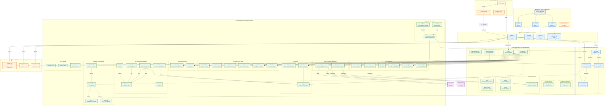

# Homelab

This repository details the configuration and deployment of my Kubernetes-native homelab.

As a Machine Learning Engineer, the purpose of my homelab is to serve as a platform for me to try and learn the newest and greatest, from Cloud Native technologies to state-of-the-art AI models. Since the best way for me to learn is to be under pressure, I started to self-host various kinds of applications for my family such that I am responsible for making any changes to the cluster and keeping the deployments operating 24/7. This repository serves as an artifact to document my journey on maintaining a secure, scalable and efficient homelab.

## Overview

```mermaid
flowchart TD
    %% ============================================
    %% 0. EXTERNAL / INTERNET
    %% ============================================
    subgraph External["🌐 External / Internet"]
        PublicUsers["Public Users"]:::external
        CF_DNS["Cloudflare DNS\n*.infra.leehosanganson.dev"]:::external
        CF_TUNNEL["Cloudflare Tunnel\nZero Trust Gateway"]:::external
    end

    %% ============================================
    %% 1. PHYSICAL LAYER - Proxmox Cluster
    %% ============================================
    subgraph Physical["🖥️ Proxmox VE Cluster (Physical Layer)"]
        PVE01["pve01\nMini PC"]:::vm
        PVE02["pve02\nMini PC"]:::vm
        PVE03["pve03\nGaming PC"]:::vm
        LAN["LAN 192.168.1.0/24\nvmbr0 Bridge"]:::physical
        ROUTER["Router / Gateway\n192.168.1.1"]:::external
    end

    %% ============================================
    %% 2. PROXMOX VMs (Infrastructure Services)
    %% ============================================
    subgraph ProxmoxVMs["📦 Proxmox VMs (Infrastructure Services)"]
        HAP1["haproxy-1\n192.168.1.251\npve01"]:::vm
        HAP2["haproxy-2\n192.168.1.252\npve02"]:::vm
        HAP3["haproxy-3\n192.168.1.253\npve03"]:::vm
        OPN1["opencode-1\n192.168.1.161\npve01\nOpenCode AI Agent :4096"]:::vm
    end

    %% ============================================
    %% 3. K3S CLUSTER - Host Nodes
    %% ============================================
    subgraph K3sCluster["⚓ K3s Kubernetes Cluster (Host Nodes)"]
        CTRL01["k3s ctrl-01\n192.168.1.151"]:::vm
        CTRL02["k3s ctrl-02\n192.168.1.152"]:::vm
        CTRL03["k3s ctrl-03\n192.168.1.153"]:::vm
        GPU_WORKER["k3s worker-gpu\nRTX 5060 Ti"]:::vm
    end

    %% ============================================
    %% 4. K8s INFRASTRUCTURE
    %% ============================================
    subgraph K8sInfra["🔧 Kubernetes Infrastructure (kubernetes/infra/)"]
        subgraph IngressCert["Ingress & Certificates"]
            TRAFIK["Traefik\nIngress Controller"]:::k8s
            CERTMGR["Cert Manager\nTLS Automation"]:::k8s
        end

        subgraph CloudTunnelK8s["Cloud Tunnel (K8s-side)"]
            CFT_K8S["Cloudflare Tunnel\ncloudflared"]:::k8s
        end

        subgraph GPUStack["GPU & AI Runtime"]
            GPUOP["GPU Operator\nNVIDIA Runtime"]:::k8s
        end

        subgraph SecretsStorage["Secrets & Storage"]
            ESO["External Secrets Op.\nAzure Key Vault Sync"]:::k8s
            SYNCSI["Synology CSI Driver\nPV Provisioning"]:::k8s
        end

        subgraph DBOperators["Database Operators"]
            CNPG["CloudNativePG\nPostgreSQL Operator"]:::k8s
        end

        subgraph RegistryMgmt["Registry & Management"]
            HARBOR["Harbor\nContainer Registry"]:::k8s
            RANCHER["Rancher\nK8s Management"]:::k8s
        end

        subgraph BackupMetrics["Backup & Metrics"]
            VELERO["Velero\nBackup/Restore + Azure"]:::k8s
            METRICS_SVR["Metrics Server\nK8s Resource Metrics"]:::k8s
        end
    end

    %% ============================================
    %% 5. K8s APPLICATIONS
    %% ============================================
    subgraph K8sApps["📦 Kubernetes Applications (kubernetes/apps/)"]
        subgraph Productivity["Productivity & Dev Tools"]
            AB["Actual Budget\nPersonal Finance"]:::k8s
            CHROME["Chrome\nInternal Browser"]:::k8s
            ITTOOL["IT-Tools\nDeveloper Collection"]:::k8s
            TERMIX["Termix\nTerminal/SSH Mobile"]:::k8s
            WHOAMI["Whoami\nDebug HTTP Service"]:::k8s
            PORTFOLIO["Portfolio\nPersonal Website"]:::k8s
        end

        subgraph DashboardBrowsing["Dashboard & Browsing"]
            HOMEPAGE["Homepage\nHome Page / Dashboard"]:::k8s
            CFED["Commafeed\nRSS Reader"]:::k8s
        end

        subgraph PhotoDoc["Photo & Document Management"]
            IMMICH["Immich\nPhoto/Video Mgmt + Redis"]:::k8s
            PAPERLESS["Paperless-ngx\nDocument Mgmt + Redis"]:::k8s
        end

        subgraph MediaSuite["Media Suite"]
            JELLYFIN["Jellyfin\nMedia Server & Player"]:::k8s
            JELLYSEERR["Jellyseerr\nMedia Discovery/Requests"]:::k8s
            NAV["Navidrome\nMusic Streaming"]:::k8s
        end

        subgraph MediaArr["*arr Suite (Media Management)"]
            PROWLARR["Prowlarr\nIndexer"]:::k8s
            QBT["qBittorrent\nDownload Client"]:::k8s
            RAD["Radarr\nMovie Management"]:::k8s
            SON["Sonarr\nTV Show Management"]:::k8s
            LID["Lidarr\nMusic Management"]:::k8s
            BAZ["Bazarr\nSubtitles"]:::k8s
        end

        subgraph AIStack["AI Services (on GPU Worker)"]
            VL["vLLM\nLLM Inference Serving"]:::k8s
            LLAMA_CPP["llama.cpp\nC/C++ LLM Inference"]:::k8s
            LITELLM["LiteLLM\nLLM Gateway"]:::k8s
            OWEBUI["OpenWebUI\nChat UI → LiteLLM"]:::k8s
        end

        subgraph OtherApps["Other Applications"]
            HA["Home Assistant\nHome Automation"]:::k8s
            N8N["n8n\nWorkflow Automation"]:::k8s
            SYNCT["Syncthing\nFile Sync"]:::k8s
            GRIM["Grimmory\nDigital Library Mgmt"]:::k8s
            MINIQR["Mini QR\nQR Code Generator"]:::k8s
            LUKQ["Life in the UK Quiz\nCustom Quiz App"]:::k8s
        end

        subgraph MonitoringStack["Monitoring & Observability"]
            PROM["Prometheus + Grafana\nkube-prometheus-stack"]:::k8s
            LOKI["Loki\nLog Aggregation"]:::k8s
            ALLOY["Alloy\nOpenTelemetry Collector"]:::k8s
        end

        subgraph OtherServices["Other Services"]
            MINECRAFT["Minecraft Server"]:::k8s
            ZOTERO["Zotero WebDAV"]:::k8s
            KARA["Karakeep\nDigital Collection"]:::k8s
        end
    end

    %% ============================================
    %% 6. EXTERNAL SERVICES (Non-managed)
    %% ============================================
    subgraph ExternalInfra["🗄️ External Infrastructure (Not managed by this repo)"]
        SYN["Synology NAS\n192.168.1.197\nFile Server & CSI PV Provisioner"]:::external
        PIH1["Pi-hole 1\n192.168.1.132"]:::external
        PIH2["Pi-hole 2\n192.168.1.133"]:::external
    end

    %% ============================================
    %% CONNECTIONS - Data Flow
    %% ============================================
    PublicUsers -->|"HTTPS"\| CF_DNS
    CF_DNS --> CFT_TUNNEL
    CFT_TUNNEL -->|"Zero Trust"\| HAP1
    PublicUsers -->|"direct"\| HAP1

    HAP1 -->|"k3s VIP"\| CTRL01
    HAP1 -->|"k3s VIP"\| CTRL02
    HAP1 -->|"k3s VIP"\| CTRL03
    HAP1 -->|"nas-1"\| SYN
    HAP1 -->|"pihole-1"\| PIH1
    HAP1 -->|"pihole-2"\| PIH2

    LAN --- PVE01
    LAN --- PVE02
    LAN --- PVE03
    PVE01 -.-> HAP1
    PVE01 -.-> OPN1
    PVE02 -.-> HAP2
    PVE03 -.-> HAP3

    CTRL01 <-->|"etcd + API"\| CTRL02
    CTRL02 <-->|"etcd + API"\| CTRL03
    CTRL01 -->|"scheduler"\| GPU_WORKER

    HAP1 -->|"traefik internal"\| TRAFIK

    TRAFIK --> AB
    TRAFIK --> CHROME
    TRAFIK --> ITTOOL
    TRAFIK --> TERMIX
    TRAFIK --> WHOAMI
    TRAFIK --> PORTFOLIO
    TRAFIK --> HOMEPAGE
    TRAFIK --> CFED
    TRAFIK --> HA
    TRAFIK --> N8N
    TRAFIK --> SYNCT
    TRAFIK --> GRIM
    TRAFIK --> MINIQR
    TRAFIK --> LUKQ
    TRAFIK --> IMMICH
    TRAFIK --> PAPERLESS
    TRAFIK --> JELLYFIN
    TRAFIK --> JELLYSEERR
    TRAFIK --> NAV
    TRAFIK --> OWEBUI
    TRAFIK --> MINECRAFT

    OWEBUI -->|"LLM API"\| LITELLM
    LITELLM -->|"route to"\| VL
    LITELLM -->|"route to"\| LLAMA_CPP

    GPU_WORKER -.-> VL
    GPU_WORKER -.-> LLAMA_CPP
    GPU_WORKER -.-> LITELLM

    PROWLARR <-->|"indexer"\| QBT
    RAD <-->|"API"\| QBT
    SON <-->|"API"\| QBT
    LID <-->|"API"\| QBT
    RAD --> JELLYFIN
    SON --> JELLYFIN
    NAV --> JELLYFIN

    IMMICH -->|"PostgreSQL"\| CNPG
    PAPERLESS -->|"PostgreSQL"\| CNPG
    N8N -->|"PostgreSQL"\| CNPG

    REDIS_IMM["Redis\n(Immich)"]:::db
    REDIS_PPL["Redis\n(Paperless)"]:::db
    IMMICH -->|"Redis"\| REDIS_IMM
    PAPERLESS -->|"Redis"\| REDIS_PPL

    SYNCSI --> SYN

    PROM --> CTRL01
    PROM --> GPU_WORKER
    ALLOY -->|"OTEL data"\| PROM
    LOKI -->|"logs"\| PROM

    classDef vm fill:#e3f2fd,stroke:#1565c0,stroke-width:2px,color:#0d47a1;
    classDef k8s fill:#e8f5e9,stroke:#2e7d32,stroke-width:2px,color:#1b5e20;
    classDef external fill:#fff3e0,stroke:#e65100,stroke-width:2px,color:#bf360c;
    classDef db fill:#f3e5f5,stroke:#7b1fa2,stroke-width:2px,color:#4a148c;
    classDef physical fill:#eceff1,stroke:#455a64,stroke-width:2px,color:#263238;
```

I use k3s for setting up my HA Kubernetes cluster, with 3 Ubuntu VMs as Control nodes, and 1 Ubuntu VM GPU Worker Node. All VMs are provisioned from my Proxmox Cluster with currently 2 Mini PCs and 1 old gaming PC. I chose k3s as it is a lightweight Kubernetes distribution and I can spin up more VMs for node replacement easily from my PVE cluster if it needs more resources.

My most recent addition to the cluster is a GPU node with a low-mid tier consumer graphics card (RTX5060 Ti). It allows me to schedule GPU workload such as local LLM inferencing server, or lightweight model training. With the current configuration, I can easily add more GPU nodes and scale out & up my private LLM inferencing service for AI workflows and Agentic Coding concurrently with my own resources.

## Services

### Applications

|                                                                            Logo                                                                            | Name                                                                  | Description                                                 |
| :--------------------------------------------------------------------------------------------------------------------------------------------------------: | --------------------------------------------------------------------- | ----------------------------------------------------------- |
|                             | [Actual Budget](https://github.com/actualbudget/actual)               | Personal finance management                                 |
|                                                          | [Commafeed](https://github.com/Athou/commafeed)                       | RSS reader                                                  |
|                                           | [Chrome](https://www.google.com/chrome/)                              | Browser for internal web browsing                           |
|                                                     | [Home Assistant](https://www.home-assistant.io/)                      | Home automation platform                                    |
|                                                     | [Homepage](https://github.com/gethomepage/homepage)                   | Customizable home page / dashboard                          |
|                                                                                                                                                            | [Grimmory](https://github.com/grimmory-tools/grimmory)                | Self-hosted digital library management                      |
|                                     | [IT-Tools](https://github.com/CorentinTh/it-tools)                    | Collection of handy online tools for developers             |
|                                                             | [Immich](https://github.com/immich-app/immich)                        | High performance self-hosted photo and video management     |
|                                                                                                            | [Life in the UK Quiz](https://github.com/)                            | Custom quiz app for Life in the UK citizenship test         |
|                                                                                      | [Mini QR](https://github.com/mini-qr/)                                | Lightweight QR code generator                               |
|                                                           | [Karakeep](https://github.com/karakeep/karakeep)                      | Digital collection organizer                                |
|                                                                   | [Minecraft Server](https://github.com/itzg/minecraft-server-charts)   | Game server for Minecraft                                   |
|                                                                                                                                                            | [Media Services (\*arr)](https://github.com/Ravencentric/awesome-arr) | A suite of applications for my media collection management. |
|                                                          | [Navidrome](https://github.com/navidrome/navidrome)                   | Music streaming server                                      |
|                                                                | [n8n](https://n8n.io/)                                                | Workflow automation tool                                    |
|                                                      | [Paperless-ngx](https://github.com/paperless-ngx/paperless-ngx)       | Document management system                                  |
|                                                                                                            | [Portfolio](https://github.com/)                                      | Personal portfolio website (self-hosted)                    |
|                                                             | [Zotero WebDAV](https://github.com/danuk/k8s-webdav)                  | Database for my Zotero Research Paper Reader                |
|                                                                                                                                                            | [Termix](https://github.com/termux/)                                  | Terminal emulator and SSH client for mobile                 |
|                                                             | [Whoami](https://github.com/antonz/whoami)                            | Simple HTTP service for debugging                           |
|                                          | [Syncthing](https://syncthing.net/)                                   | Continuous file synchronization                             |

### AI

|                                                    Logo                                                    | Name                                                   | Description                                                                |
| :--------------------------------------------------------------------------------------------------------: | ------------------------------------------------------ | -------------------------------------------------------------------------- |
|               | [vLLM](https://github.com/vllm-project/vllm)           | High-throughput and memory-efficient inference and serving engine for LLMs |
|                                                                                                            | [llama.cpp](https://github.com/ggerganov/llama2.cpp)   | LLM inference in C/C++                                                     |
|          | [LiteLLM](https://github.com/BerriAI/litellm)          | LLM Gateway for local LLM servers & other cloud providers.                 |
|                                                                                                            | [OpenCode](https://opencode.ai/docs/web/)              | Browser-based remote coding agent server (runs on Proxmox VM opencode-1)  |
|  | [Open WebUI](https://github.com/open-webui/open-webui) | Frontend Chat interface connected to LiteLLM                               |

### Infrastructure

|                                                                      Logo                                                                      | Name                                                                      | Description                                         |
| :--------------------------------------------------------------------------------------------------------------------------------------------: | ------------------------------------------------------------------------- | --------------------------------------------------- |
|                           | [Traefik](https://github.com/traefik/traefik)                             | Ingress Controller for Kubernetes workloads         |
|                                                            | [Cloudflare Tunnel](https://github.com/cloudflare/cloudflared)            | Zero Trust Tunnel to expose services publicly       |
|                                 | [HAProxy](https://www.haproxy.org/)                                       | L4 load balancer & SSL termination (3 VMs on Proxmox)|
|                                                           | [Pi-hole](https://pi-hole.net/)                                           | Network-wide ad blocking DNS (2 VMs on Proxmox)     |
|  | [GPU Operator](https://github.com/NVIDIA/gpu-operator)                    | NVIDIA runtime class manager for AI/ML workloads    |
|                                           | [Cert Manager](https://github.com/cert-manager/cert-manager)              | Automated X.509 certificate management              |
|                                                        | [External Secrets Operator](https://external-secrets.io/latest/)          | External secrets in Azure Key Vault                 |
|                                                                         | [CloudNativePG](https://github.com/cloudnative-pg/cloudnative-pg)         | PostgreSQL DB Cluster for other applications        |
|                                                       | [Synology NAS](https://www.synology.com/)                                 | File server & CSI Persistent Volume Provisioner     |

### Monitoring & Observability

|                                                                                                                                 Logo                                                                                                                                  | Name                                                                                                                | Description                                                                |
| :-------------------------------------------------------------------------------------------------------------------------------------------------------------------------------------------------------------------------------------------------------------------: | ------------------------------------------------------------------------------------------------------------------- | -------------------------------------------------------------------------- |
|    | [kube-prometheus-stack](https://github.com/prometheus-community/helm-charts/tree/main/charts/kube-prometheus-stack) | Out-of-the-box monitoring solution: Prometheus, Grafana, and Alertmanager. |
|                                                                                                                                                                      | [Loki](https://github.com/grafana/loki)                                                                             | Prometheus, but for logs                                                   |
|                                                                                                                                         | [Alloy](https://github.com/grafana/alloy)                                                                           | OpenTelemetry Collector                                                    |

