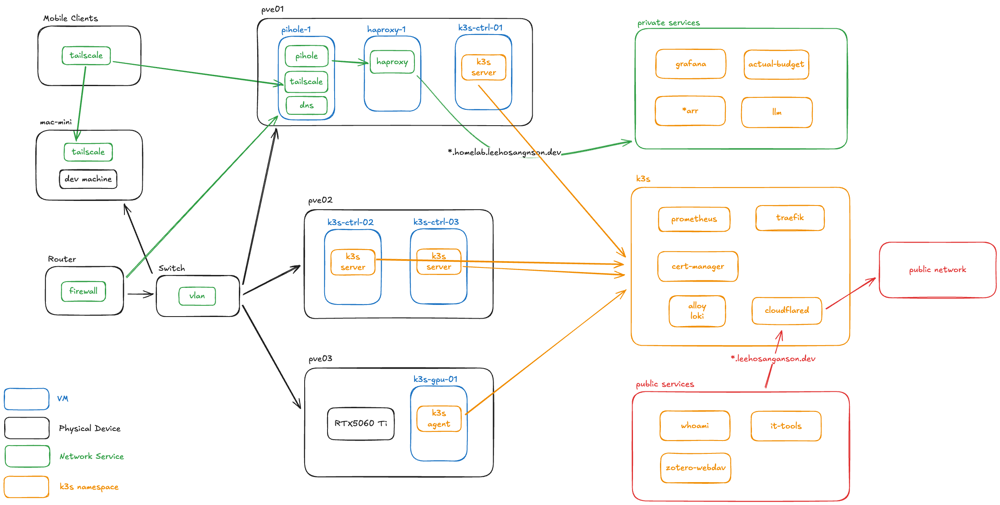

# Homelab

This repository details the configuration and deployment of my Kubernetes-native homelab.

As a Machine Learning Engineer, the purpose of my homelab is to serve as a platform for me to try and learn the newest and greatest, from Cloud Native technologies to state-of-the-art AI models. Since the best way for me to learn is to be under pressure, I started to self-host various kinds of applications for my family such that I am responsible for making any changes to the cluster and keeping the deployments operating 24/7. This repository serves as an artifact to document my journey on maintaining a secure, scalable and efficient homelab.

## Overview



I use k3s for setting up my HA Kubernetes cluster, with 3 Ubuntu VMs as Control nodes, and 1 Ubuntu VM GPU Worker Node. All VMs are provisioned from my Proxmox Cluster with currently 2 Mini PCs and 1 old gaming PC. I chose k3s as it is a lightweight Kubernetes distribution and I can spin up more VMs for node replacment easily from my PVE cluster if it needs more resources.

My most recent addition to the cluster is a GPU node with a low-mid tier consumer graphics card (RTX5060 Ti). It allows me to schedule GPU workload such as local LLM inferencing server, or lightweight model training. With the current configuration, I can easily add more GPU nodes and scale out & up my private LLM inferencing service for AI workflows and Agentic Coding concurrently with my own resources.

## Infrastructure as Code

NixOS VMs (e.g. `haproxy-1`) are provisioned and configured using a fully declarative, two-layer IaC approach.

### Layer 1 — VM Lifecycle (Terraform)

Terraform (`terraform/`) manages the virtual hardware boundary of each VM on Proxmox using the [bpg/proxmox](https://registry.terraform.io/providers/bpg/proxmox/latest) provider. It defines CPU, memory, disk size, and network — but intentionally avoids Cloud-Init or any OS-level configuration.

```bash
cd terraform
terraform init
terraform apply
```

### Layer 2 — OS & Configuration (NixOS + nixos-anywhere + disko)

Once Terraform creates the blank VMs, `nixos-anywhere` + `disko` remotely partitions the disk and installs NixOS from the flake in one step.

#### Build the installer ISO (one-time setup)

Build a minimal NixOS installer ISO, upload it to Proxmox storage, and reference it in `terraform.tfvars` as `nixos_iso`. Terraform will attach the ISO to new VMs so they boot into the installer.

```bash
cd nixos
nix build .#packages.x86_64-linux.installer
# result/iso/nixos-*.iso  →  upload to Proxmox
```

#### Initial provisioning

Boot the VM from the installer ISO (start it in Proxmox), then run:

```bash
./nixos/scripts/provision.sh haproxy-1 192.168.1.251
```

This calls `nixos-anywhere --flake .#haproxy-1 root@192.168.1.251`, which uses disko to partition `/dev/sda` and installs the full NixOS configuration in one shot.

To inject pre-generated SSH host keys for sops-nix Day-0 secret decryption, place them under `scripts/keys/<hostname>/etc/ssh/` before running `provision.sh`.

#### Updating an existing host

```bash
./nixos/scripts/rebuild.sh haproxy-1 192.168.1.251
```

This runs `nixos-rebuild switch --target-host root@192.168.1.251`, building the new closure locally and activating it on the remote host over SSH.

### Secrets (sops-nix)

Secrets are managed with [sops-nix](https://github.com/Mic92/sops-nix). Each host has a pre-generated SSH host key whose **public** key is registered as an age recipient in the sops-secrets repository. The corresponding **private** key is injected onto the host at provisioning time via `nixos-anywhere --extra-files` (stored locally in `nixos/scripts/keys/<hostname>/etc/ssh/`, which is gitignored). On first boot, sops-nix uses the SSH host key to derive the age private key for decrypting secrets.

## Services

### Applications

|                                                                            Logo                                                                            | Name                                                                  | Description                                                 |
| :--------------------------------------------------------------------------------------------------------------------------------------------------------: | --------------------------------------------------------------------- | ----------------------------------------------------------- |
|                             | [Actual Budget](https://github.com/actualbudget/actual)               | Personal finance management                                 |
|                                                          | [Commafeed](https://github.com/Athou/commafeed)                       | RSS reader                                                  |
|                                                                                                                                                            | [Grimmory](https://github.com/grimmory-tools/grimmory)                | Self-hosted digital library management                      |
|                                     | [IT-Tools](https://github.com/CorentinTh/it-tools)                    | Collection of handy online tools for developers             |
|                                                          | [Navidrome](https://github.com/navidrome/navidrome)                   | Music streaming server                                      |
|                                                             | [Immich](https://github.com/immich-app/immich)                        | High performance self-hosted photo and video management     |
|                                                                | [n8n](https://n8n.io/)                                                | Workflow automation tool                                    |
|                                                      | [Paperless-ngx](https://github.com/paperless-ngx/paperless-ngx)       | Document management system                                  |
|                                                             | [Zotero WebDAV](https://github.com/danuk/k8s-webdav)                  | Database for my Zotero Research Paper Reader                |
|                                                           | [Karakeep](https://github.com/karakeep/karakeep)                      | Digital collection organizer                                |
|                                                                   | [Minecraft Server](https://github.com/itzg/minecraft-server-charts)   | Game server for Minecraft                                   |
|  | [Uptime Kuma](https://github.com/louislam/uptime-kuma)                | Service monitoring and health check                         |
|                                                                                                                                                            | [Media Services (\*arr)](https://github.com/Ravencentric/awesome-arr) | A suite of applications for my media collection management. |
|                                          | [Syncthing](https://syncthing.net/)                                   | Continuous file synchronization                             |

### AI

|                                                    Logo                                                    | Name                                                   | Description                                                                |
| :--------------------------------------------------------------------------------------------------------: | ------------------------------------------------------ | -------------------------------------------------------------------------- |
|               | [vLLM](https://github.com/vllm-project/vllm)           | High-throughput and memory-efficient inference and serving engine for LLMs |
|                                                                                                            | [llama.cpp](https://github.com/ggerganov/llama2.cpp)   | LLM inference in C/C++                                                     |
|          | [LiteLLM](https://github.com/BerriAI/litellm)          | LLM Gateway for local LLM servers & other cloud providers.                 |
|  | [Open WebUI](https://github.com/open-webui/open-webui) | Frontend Chat interface connected to LiteLLM                               |

### Infrastructure

|                                                                      Logo                                                                      | Name                                                                      | Description                                         |
| :--------------------------------------------------------------------------------------------------------------------------------------------: | ------------------------------------------------------------------------- | --------------------------------------------------- |
|                           | [Traefik](https://github.com/traefik/traefik)                             | Ingress Controller                                  |
|                                                            | [Cloudflare Tunnel](https://github.com/cloudflare/cloudflared)            | Zero Trust Tunnel to expose services publicly       |
|  | [GPU Operator](https://github.com/NVIDIA/gpu-operator)                    | NVIDIA runtime class manager for AI/ML workloads    |
|                                           | [Cert Manager](https://github.com/cert-manager/cert-manager)              | Automated X.509 certificate management              |
|                                                        | [External Secrets Operator](https://external-secrets.io/latest/)          | External secrets in Azure Key Vault                 |
|                                                                         | [CloudNativePG](https://github.com/cloudnative-pg/cloudnative-pg)         | PostgreSQL DB Cluster for other applications        |
|                                                       | [Synology CSI Driver](https://github.com/SynologyOpenSource/synology-csi) | Persistent Volume Provisioning from my Synology NAS |

### Monitoring & Observability

|                                                                                                                                 Logo                                                                                                                                  | Name                                                                                                                | Description                                                                |
| :-------------------------------------------------------------------------------------------------------------------------------------------------------------------------------------------------------------------------------------------------------------------: | ------------------------------------------------------------------------------------------------------------------- | -------------------------------------------------------------------------- |
|    | [kube-prometheus-stack](https://github.com/prometheus-community/helm-charts/tree/main/charts/kube-prometheus-stack) | Out-of-the-box monitoring solution: Prometheus, Grafana, and Alertmanager. |
|                                                                                                                                                                      | [Loki](https://github.com/grafana/loki)                                                                             | Prometheus, but for logs                                                   |
|                                                                                                                                         | [Alloy](https://github.com/grafana/alloy)                                                                           | OpenTelemetry Collector                                                    |
