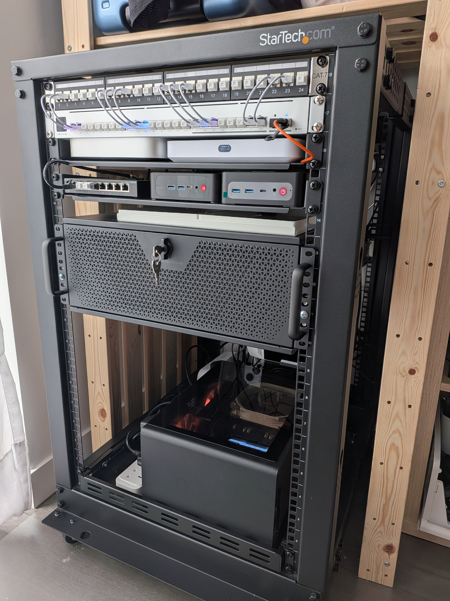
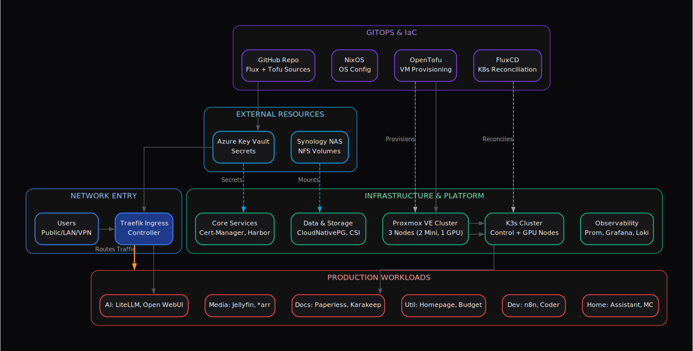

# Homelab

This repository documents the configuration and deployment of my Kubernetes-native homelab.

As a Machine Learning Engineer, I built this space to learn Cloud Native technologies and state-of-the-art AI models by putting myself under real pressure - running them for real instead of just tinkering in isolation. To keep things interesting, I started self-hosting all sorts of apps for my family, so now I'm the one responsible for keeping everything running 24/7. This repo is my way of documenting that journey as I try to maintain a homelab that's secure, scalable, and actually useful.

  

## Overview

### Architecture

  

I run a 3-node HA Kubernetes cluster using k3s, with Ubuntu VMs handling the control plane and one GPU-enabled worker node doing the heavy lifting. Everything runs out of my Proxmox cluster, currently 2 Mini PCs and an old gaming PC. I picked k3s because it's lightweight enough that I can spin up replacement nodes from Proxmox whenever a machine needs more resources or gets swapped out.

The newest addition to the cluster is a GPU node packed with an RTX 5060 Ti, not top-of-the-line, but more than enough to run local LLM inference and light model training. It's opened up a whole new world for running AI workflows and Agentic Coding locally. And if I ever need more compute, adding another GPU node to the cluster is pretty straightforward, so I can scale out and up without relying on anyone else's resources.

## Services

### Applications

|                                                              Logo                                                               | Name                                                                         | Description                                                 |
| :-----------------------------------------------------------------------------------------------------------------------------: | ---------------------------------------------------------------------------- | ----------------------------------------------------------- |
|  | [Actual Budget](https://github.com/actualbudget/actual)                      | Personal finance management                                 |
|                               | [Commafeed](https://github.com/Athou/commafeed)                              | RSS reader                                                  |
|                 | [Chrome](https://www.google.com/chrome/)                                     | Browser for internal web browsing                           |
|                          | [Home Assistant](https://www.home-assistant.io/)                             | Home automation platform                                    |
|                                | [Homepage](https://github.com/gethomepage/homepage)                          | Customizable home page / dashboard                          |
|                                             | [Grimmory](https://github.com/grimmory-tools/grimmory)                       | Self-hosted digital library management                      |
|          | [IT-Tools](https://github.com/CorentinTh/it-tools)                           | Collection of handy online tools for developers             |
|                                  | [Immich](https://github.com/immich-app/immich)                               | High performance self-hosted photo and video management     |
|                                                                                                                                 | [Life in the UK Quiz](https://github.com/leehosanganson/life-in-the-uk-quiz) | Custom quiz app for Life in the UK citizenship test         |
|                                               | [Mini QR](https://github.com/mini-qr/)                                       | Lightweight QR code generator                               |
|                                | [Karakeep](https://github.com/karakeep/karakeep)                             | Digital collection organizer                                |
|                                        | [Minecraft Server](https://github.com/itzg/minecraft-server-charts)          | Game server for Minecraft                                   |
|                                                                                                                                 | [Media Services (\*arr)](https://github.com/Ravencentric/awesome-arr)        | A suite of applications for my media collection management. |
|                               | [Navidrome](https://github.com/navidrome/navidrome)                          | Music streaming server                                      |
|                                     | [n8n](https://n8n.io/)                                                       | Workflow automation tool                                    |
|                           | [Paperless-ngx](https://github.com/paperless-ngx/paperless-ngx)              | Document management system                                  |
|                                                                                                                                 | [Portfolio](https://github.com/leehosanganson/portfolio)                     | Personal portfolio website (self-hosted)                    |
|                                  | [Zotero WebDAV](https://github.com/danuk/k8s-webdav)                         | Database for my Zotero Research Paper Reader                |
|                                 | [Termix](https://github.com/termux/)                                         | Terminal emulator and SSH client for mobile                 |
|                                                                                                                                 | [Whoami](https://github.com/antonz/whoami)                                   | Simple HTTP service for debugging                           |
|               | [Syncthing](https://syncthing.net/)                                          | Continuous file synchronization                             |

### AI

|                                                    Logo                                                    | Name                                                   | Description                                                              |
| :--------------------------------------------------------------------------------------------------------: | ------------------------------------------------------ | ------------------------------------------------------------------------ |
|                       | [llama.cpp](https://github.com/ggerganov/llama2.cpp)   | LLM inference in C/C++                                                   |
|          | [LiteLLM](https://github.com/BerriAI/litellm)          | LLM Gateway for local LLM servers & other cloud providers.               |
|  | [OpenCode](https://opencode.ai/docs/web/)              | Browser-based remote coding agent server (runs on Proxmox VM opencode-1) |
|  | [Open WebUI](https://github.com/open-webui/open-webui) | Frontend Chat interface connected to LiteLLM                             |

### Infrastructure

|                                                                      Logo                                                                      | Name                                                              | Description                                           |
| :--------------------------------------------------------------------------------------------------------------------------------------------: | ----------------------------------------------------------------- | ----------------------------------------------------- |
|                           | [Traefik](https://github.com/traefik/traefik)                     | Ingress Controller for Kubernetes workloads           |
|                                                            | [Cloudflare Tunnel](https://github.com/cloudflare/cloudflared)    | Zero Trust Tunnel to expose services publicly         |
|                                  | [HAProxy](https://www.haproxy.org/)                               | L4 load balancer & SSL termination (3 VMs on Proxmox) |
|                                                           | [Pi-hole](https://pi-hole.net/)                                   | Network-wide ad blocking DNS (2 VMs on Proxmox)       |
|  | [GPU Operator](https://github.com/NVIDIA/gpu-operator)            | NVIDIA runtime class manager for AI/ML workloads      |
|                                           | [Cert Manager](https://github.com/cert-manager/cert-manager)      | Automated X.509 certificate management                |
|                                                        | [External Secrets Operator](https://external-secrets.io/latest/)  | External secrets in Azure Key Vault                   |
|                                                                         | [CloudNativePG](https://github.com/cloudnative-pg/cloudnative-pg) | PostgreSQL DB Cluster for other applications          |
|                                                       | [Synology NAS](https://www.synology.com/)                         | File server & CSI Persistent Volume Provisioner       |

### Monitoring & Observability

|                                                              Logo                                                              | Name                                      | Description                                  |
| :----------------------------------------------------------------------------------------------------------------------------: | ----------------------------------------- | -------------------------------------------- |
|                            | [Prometheus](https://prometheus.io/)      | Metrics collection and monitoring system     |
|                               | [Grafana](https://grafana.com/)           | Dashboard for metrics and logs visualization |
|                               | [Loki](https://github.com/grafana/loki)   | Prometheus, but for logs                     |
|  | [Alloy](https://github.com/grafana/alloy) | OpenTelemetry Collector                      |
